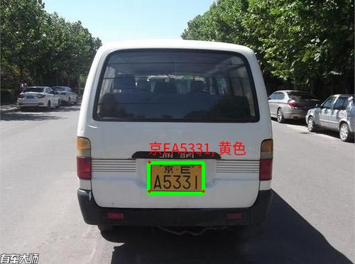

# RK3588 yolov5-face RKNPU 人脸检测

## 介绍
基于[yolov5-face-RK3588](https://github.com/YaoQ/yolov5-face-RK3588),在RK3588上运行[car recognition](https://github.com/we0091234/Car_recognition)检测模型,实现车辆+车牌检测,并输出车牌的4个landmark点,用于车牌识别之前的矫正.


## 环境依赖
- RK3588 Debian11 
- rknntoolit 1.6.0
- rknnnpu 1.6.0
- opencv4+

## 模型
python 使用的模型尺寸
```
输入： 1 3 640 640
输出：
1 3 80 80 16
1 3 40 40 16
1 3 20 20 16
``` 

## 后处理之前的模型输出结构说明
16位分别对应: [x, y, w, h , conf, x1, y1, x2, y2, x3, y3, x4, y4, cls0, cls1, cls2]
其中检测标签:
- cls0: 单层车牌
- cls1: 双层车牌
- cls2: 车


## python推理测试
```bash
# python
cd python
python python yolov5-plate_rknnlite.py --input ../imgs/京A25016_32.jpg --model ../weights/car_plate_detect_1x3x80x80x16-640-640_rm_transpose_rk3588.rknn
```



## C++代码推理测试

```bash
cd cpp
bash build-linux_RK3588.sh # 在RK3588上直接编译
cd build
./rknn_yolov5_demo  ../../weights/car_plate_detect_1x3x80x80x16-640-640_rm_transpose_rk3588.rknn ../../imgs/沪A5L320.jpg 

# 运行结果:
post process config: box_conf_threshold = 0.25, nms_threshold = 0.45
Loading mode...
sdk version: 1.6.0 (9a7b5d24c@2023-12-13T17:31:11) driver version: 0.9.2
model input num: 1, output num: 3
  index=0, name=input, n_dims=4, dims=[1, 640, 640, 3], n_elems=1228800, size=1228800, w_stride = 640, size_with_stride=1228800, fmt=NHWC, type=INT8, qnt_type=AFFINE, zp=-128, scale=0.003922
  index=0, name=output, n_dims=5, dims=[1, 3, 80, 80, 16], n_elems=307200, size=307200, w_stride = 0, size_with_stride=307200, fmt=UNDEFINED, type=INT8, qnt_type=AFFINE, zp=63, scale=0.176689
  index=1, name=975, n_dims=5, dims=[1, 3, 40, 40, 16], n_elems=76800, size=76800, w_stride = 0, size_with_stride=76800, fmt=UNDEFINED, type=INT8, qnt_type=AFFINE, zp=44, scale=0.161176
  index=2, name=987, n_dims=5, dims=[1, 3, 20, 20, 16], n_elems=19200, size=19200, w_stride = 0, size_with_stride=19200, fmt=UNDEFINED, type=INT8, qnt_type=AFFINE, zp=84, scale=0.329176
model is NHWC input fmt
model input height=640, width=640, channel=3
Read ../../imgs/沪A5L320.jpg ...
img width = 1920, img height = 1080
resize image with letterbox
once run use 35.621000 ms
loadLabelName ../../weights/plate.txt
car @ (465 279 1059 735) 0.875814
Single-L @ (762 672 882 720) 0.867393
save detect result to ./out.jpg
loop count = 10 , average run  29.781800 ms
```


## 模型转换说明
在导出onnx模型时，由于输出的尺度不一样，特别说明一下，截断得到3输出，尺寸是(1, 3, 80, 80, 16)

[Car_recognition/yolo.py](https://github.com/we0091234/Car_recognition/blob/master/models/yolo.py)

```
 45     def forward(self, x):
 46         # x = x.copy()  # for profiling
 47         z = []  # inference output
 48         if self.export_cat:
 49             for i in range(self.nl):
 50                 x[i] = self.m[i](x[i])  # conv
 51                 bs, _, ny, nx = x[i].shape  # x(bs,255,20,20) to x(bs,3,20,20,85)
 52 
 53                 x[i] = x[i].view(bs, self.na, self.no, ny, nx).permute(0, 1, 3, 4, 2).contiguous()
 54             return x

```
备注：
如果需要导出其他的尺度，需要修改52行代码，将view的尺寸修改为相应的要求来适配：(bs, self.na, self.no, ny, nx)


# 参考
- https://github.com/we0091234/Car_recognition 
